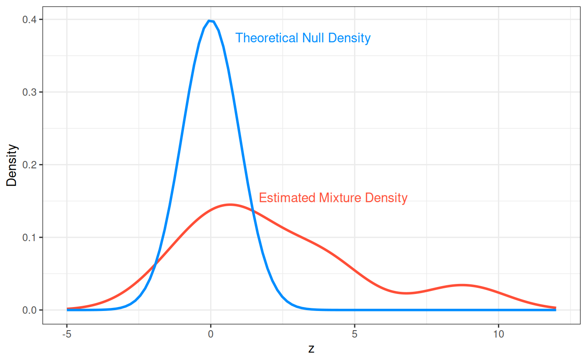

# Inference: Local mfdr

## Local False Discovery Rates

Classical, single-feature, hypothesis testing approaches rely upon
tail-area probabilies, or the probability that a test statistic, z,
exceeds a certain value. In contrast, *local approaches* like [local
mfdr](https://arxiv.org/abs/1809.05497) base inference on that feature’s
specific value value of z without considering the hypothetical
possibility of more extreme results.

Local false discovery rates are a Bayesian idea that can be implemented
in large-scale testing situations by using empirical Bayes methods to
obtain estimates of: Pr(H\_{0j} \| z_j = z)

The probability of the j^{th} null hypothesis being true, conditional
upon the exact value of the observed test statistic z_j. This
probability is defined as the *local false discovery rate* for the
j^{th} feature.

## Estimation

Using Bayes’ rule, we have

Pr(H\_{0j} \| z_j = z) = \frac{\pi_0 f_0(z)}{\pi_0f_0(z) + (1 - \pi_0)
f_1(z)},

where \pi_0 is the prior probability of a true null hypothesis for the
collection of tests, f_0 is the theoretical density of test statistics
under the null, and f_1 is the density of non-null test statistics.

A variety of estimators are possible depending on how one goes about
estimating this mixture of densities. One simple approach, currently
used by `ncvreg`, is to set \pi_0 = 1 and to avoid estimating f_1 by
estimating only the marginal density f(z) using a kernel density
approach. Thus:

\widehat{\text{mfdr}}(z) = \frac{\pi_0 f_0(z)}{\hat{f}(z)}. In
situations where f_0(z) \> \hat{f}(z), local mfdr estimates are capped
at 1.

## Test Statistics

For each predictor,
[`mfdr()`](https://pbreheny.github.io/ncvreg/reference/mfdr.md)
constructs a test statistic based upon the mathematical conditions
necessary for that variable to enter the model characterized by a given
value of \lambda. For linear regression models, these statistics have
the form:

z_j = \frac{\mathbf{x}\_j^T(\mathbf{y} -
\mathbf{X}\_{-j}\mathbf{\beta}\_{-j})}{\sigma/\sqrt{n}} The subscript -j
indicates the removal of the j^{th} predictor. For logistic and Cox
regression models, these statistics have the form:

z_j = \frac{u_j+ v_j\beta_j}{\sqrt{v_j}} Here u_j is the unpenalized
score function (ie: the first derivative, with respect to \beta_j, of
the log-likelihood), and v_j is the j^{th} diagonal element of the
unpenalized Hessian matrix (ie: the second derivative of the
log-likelihood)

Under feature independence, each of these statistics will follow a
standard normal distribution under the null hypothesis of that predictor
being independent of the current model’s residuals. Despite being
derived under independence, `mfdr` tends to be accurate under mild to
moderate dependence structures, see [Miller and Breheny
(2018)](https://arxiv.org/abs/1809.05497) for additional details.

## Examples

Local mfdr estimates can be obtained via the
[`summary()`](https://rdrr.io/r/base/summary.html) function:

``` r
fit <- ncvreg(Prostate$X, Prostate$y)
summary(fit, lambda = 0.07,  number = Inf)
# MCP-penalized linear regression with n=97, p=8
# At lambda=0.0700:
# -------------------------------------------------
#   Features satisfying criteria       : 8
#   Average mfdr among chosen features : 0.592
# 
#          Estimate       z     mfdr Selected
# lcavol   0.530785  8.7704  < 1e-04        *
# svi      0.684680  3.9737 0.010695        *
# lweight  0.622144  3.7369 0.026104        *
# lbph     0.038452  1.5077 0.901245        *
# age     -0.004084 -1.2704 0.926945        *
# pgg45    0.000000  0.8675 0.951263         
# gleason  0.000000  0.7467 0.955590         
# lcp      0.000000 -0.2711 0.964801
```

The argument `number = Inf` requests mfdr estimates for all features,
regardless of whether or not they are active in the specified model.
These estimates can be understood by studying the theoretical null and
empirically estimated mixture densities for these data:



The feature `lcavol` has an extremely small estimated mfdr with a
statistic of z = 8.77, the origin of this estimate is apparent when
examining the ratio between the null and mixture densities at z = 8.88.
In contrast, the feature `lbph` has a estimated mfdr of 0.94 with a
statistic of z = 1.51, this estimated is explained by the null and
mixture densities being similar near z = 1.51.
