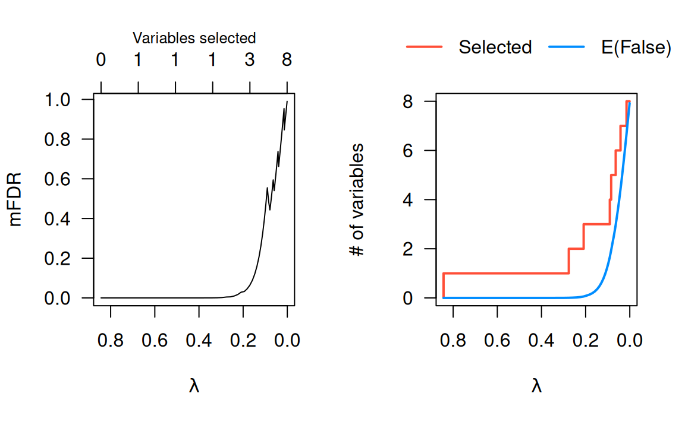

# Inference: Marginal false discovery rates

Consider the following causal diagram:


Variable A could never be considered a false discovery: it has a direct
causal relationship with the outcome Y. Likewise, if variable N were
selected, this would obviously count as a false discovery – N has no
relationship, direct or indirect, to the outcome.

Variable B, however, occupies a gray area as far as false discoveries
are concerned. From a marginal perspective, B is not a false discovery,
since it is not independent of Y. However, from a fully conditional
perspective, B is a false discovery because B and Y are conditionally
independent given A. Finally, from a modeling perspective, we could also
adopt the point of view that B is a false discovery only if A is already
in the model.

To be more specific, here are the definitions of a false discovery under
these three perspectives:

- **Marginal** — A selected feature j is a false discovery if it is
  marginally independent of the outcome: X_j \perp\\\\\\\perp Y.
- **Fully conditional** — A selected feature j is a false discovery if
  it is independent of the outcome given all other features: X_j
  \perp\\\\\\\perp Y \| \\X_k\\\_{k \neq j}.
- **Partially conditional** — A selected feature j is a false discovery
  if it is independent of the outcome given the other features in the
  model: X_j \perp\\\\\\\perp Y \| \\X_k:k \in \mathcal{M}\_{j-}\\,
  where \mathcal{M}\_{j-} denotes the set of features with nonzero
  coefficients in the model, excluding feature j.

Estimating the number of false selections from fully conditional and
partially conditional perspectives is both complicated and tends to have
low power (because it is typically difficulty to distinguish between
variables like B and variables like A in high dimensions).

Estimating the number of false discoveries from the marginal
perspective, however, is much easier. We illustrate the concept behind
marginal false discovery rates (mFDR) below; see the [original
article](https://doi.org/10.1093/biostatistics/kxy004) for more details
on the mathematics behind it.

First, let’s fit a lasso model:

``` r
data(Prostate)
fit <- ncvreg(Prostate$X, Prostate$y)
```

The marginal false discovery rate at a given value of \lambda is given
by

\text{mFDR}(\lambda) =
\frac{\mathbb{E}(\text{mFD}(\lambda))}{S(\lambda)},

where S(\lambda) is the number of variables selected and
\text{mFD}(\lambda) is the number of (marginal) false discoveries –
i.e., the number of pure noise variables like N that have been selected.
The [`mfdr()`](https://pbreheny.github.io/ncvreg/reference/mfdr.md)
function estimates the expected value of \text{mFD}(\lambda) based on
the hypothetical null scenario in which all predictors are noise and
calculates the mFDR:

``` r
marginal_fdr <- mfdr(fit)
```

At the start of the lasso path, only one variable has been selected, and
\lambda is so large that it would be extremely unlikely for any
selections to have occurred by chance alone; as a result, the mFDR is
very low:

``` r
head(marginal_fdr)
#                   EF S         mFDR
# 0.84343 0.000000e+00 0 0.000000e+00
# 0.78658 1.418692e-11 1 1.418692e-11
# 0.73357 3.642789e-11 1 3.642789e-11
# 0.68413 1.098086e-10 1 1.098086e-10
# 0.63802 3.833845e-10 1 3.833845e-10
# 0.59502 1.516932e-09 1 1.516932e-09
```

Towards the end of the lasso path, all variables has been selected, and
\lambda is so small that even if all the predictors were noise, we would
probably select them anyway; as a result, the mFDR is very high:

``` r
tail(marginal_fdr)
#               EF S      mFDR
# 0.00120 7.892559 8 0.9865699
# 0.00111 7.899799 8 0.9874749
# 0.00104 7.906552 8 0.9883190
# 0.00097 7.912850 8 0.9891062
# 0.00090 7.918723 8 0.9898404
# 0.00084 7.924201 8 0.9905251
```

Marginal FDRs will typically be most valuable somewhere in the middle:

``` r
marginal_fdr[24:27,]
#                EF S       mFDR
# 0.16946 0.1931229 3 0.06437429
# 0.15804 0.2665980 3 0.08886599
# 0.14739 0.3606589 3 0.12021962
# 0.13746 0.4775792 3 0.15919307
```

For this data set, we can select three features at a low false discovery
rate, but the FDR increases above 10% as we consider models with lower
penalties. A plotting method is provided for mFDR objects, with two
available plot types:

``` r
par(mfrow = c(1,2))
plot(marginal_fdr, type = "mFDR")
plot(marginal_fdr, type = "EF")
```



The mFDR is a global measure that describes the entire model; for
feature-specific false discovery rates, see the article on [local
mfdr](https://pbreheny.github.io/ncvreg/articles/inference-local).
