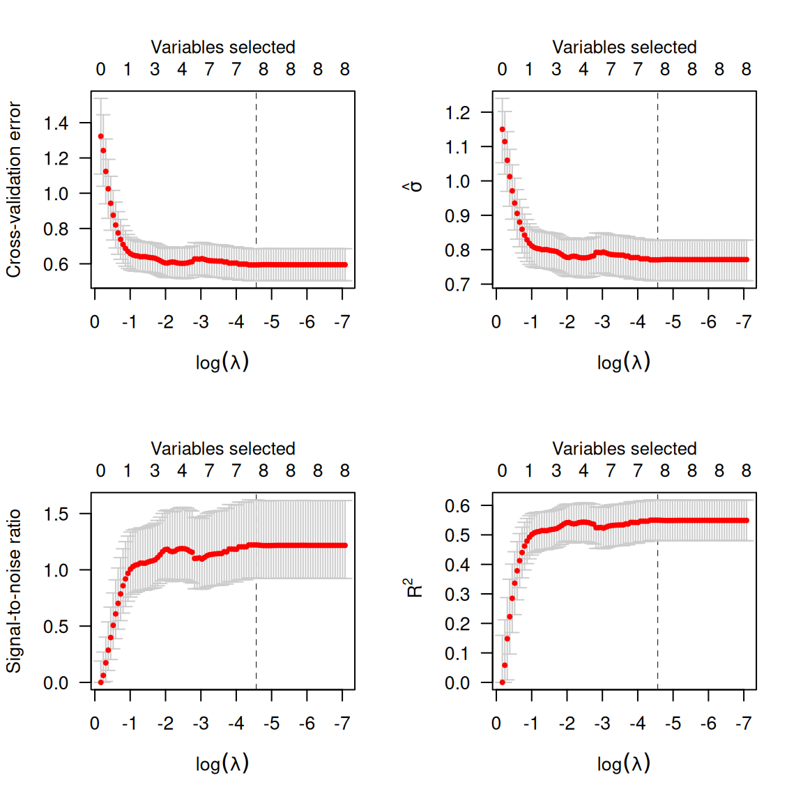
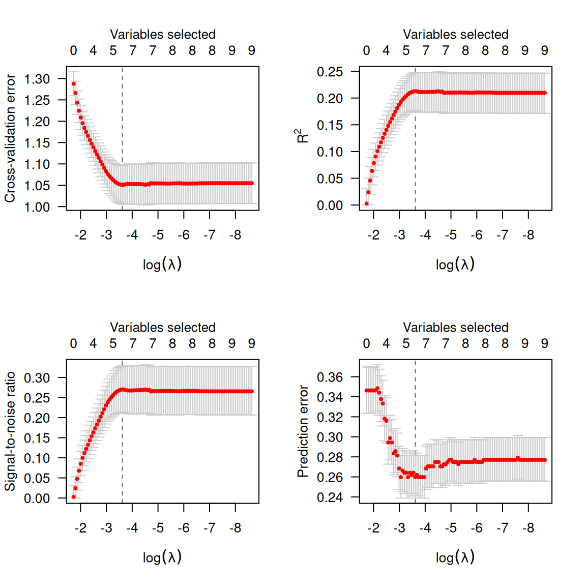

# Models

`ncvreg` fits models that fall into the penalized likelihood framework.
Rather than estimating \boldsymbol{\beta} by maximizing the likelihood,
in this framework we estimate \boldsymbol{\beta} by minimizing the
objective function

Q(\boldsymbol{\beta}\\\vert\\\mathbf{X}, \mathbf{y}) =
\frac{1}{n}L(\boldsymbol{\beta}\\\vert\\\mathbf{X},\mathbf{y}) +
P\_\lambda(\boldsymbol{\beta}),

where the loss function L(\boldsymbol{\beta}\|\mathbf{X},\mathbf{y}) is
the deviance (-2 times the log-likelihood),
P\_\lambda(\boldsymbol{\beta}) is the penalty, and \lambda is a
regularization parameter that controls the tradeoff between the two
components. This article describes the different loss models available
in `ncvreg`; see
[penalties](https://pbreheny.github.io/ncvreg/articles/penalties.md) for
more information on the different penalties available.

## Gaussian (linear regression)

In linear regression, the loss function is simply the squared error
loss:

L(\boldsymbol{\beta}\\\vert\\\mathbf{X},\mathbf{y}) =
\lVert\mathbf{y}-\mathbf{X}\boldsymbol{\beta}\rVert_2^2;

this loss is proportional to the deviance if the outcome \mathbf{y}
follows a normal distribution with constant variance and mean given by
\mathbf{X}\boldsymbol{\beta}.

In the `Prostate` data packaged with `ncvreg`, the response is the
prostate specific antigen (PSA), measured on the log scale, and follows
an approximate normal distribution; see
[`?Prostate`](https://pbreheny.github.io/ncvreg/reference/Prostate.md)
for more information on the data set. Loading this data set into R,

``` r
data(Prostate)
X <- Prostate$X
y <- Prostate$y
```

By default, `ncvreg` fits a linear regression model with a minimax
concave penalty (MCP):

``` r
fit <- ncvreg(X, y)
```

This produces a path of coefficient estimates, which we can plot with

``` r
plot(fit)
```


Although the least squares loss function is convex, the MCP penalty is
not. The resulting objective function, therefore, may or may not be
convex. `ncvreg` uses a local convexity diagnostic, as described in
[Breheny and Huang
(2011)](https://myweb.uiowa.edu/pbreheny/pdf/Breheny2011.pdf), to
identify the regions of the coefficient path where the objective
function is not convex; this is the gray shaded region in the plot.
Users should be aware that solutions in this region may only be local
optima of the objective function, not global ones.

Post-selection inference is available using the `summary` method:

``` r
summary(fit, lambda=0.05)
# MCP-penalized linear regression with n=97, p=8
# At lambda=0.0500:
# -------------------------------------------------
#   Nonzero coefficients         :   6
#   Expected nonzero coefficients:   2.54
#   Average mfdr (6 features)    :   0.424
# 
#         Estimate      z     mfdr Selected
# lcavol   0.53179  8.880  < 1e-04        *
# svi      0.67256  3.945 0.010189        *
# lweight  0.60390  3.666 0.027894        *
# lbph     0.08875  1.928 0.773014        *
# age     -0.01531 -1.788 0.815269        *
# pgg45    0.00168  1.160 0.917570        *
```

The local marginal false discovery rate (mfdr) is given for each of the
selected features. Roughly, this corresponds to the probability that the
given feature is marginally independent of the residuals at that value
of \lambda. In this case, it would appear that `lcavol`, `svi`, and
`lweight` are clearly associated with the response, even after adjusting
for the other variables in the model, while `lbph`, `age`, and `pgg45`
may be false positives selected simply by chance. For more information
on [`summary()`](https://rdrr.io/r/base/summary.html) and its various
options, see
[here](https://pbreheny.github.io/ncvreg/articles/inference-local.md).

Typically, one would carry out cross-validation for the purposes of
assessing the predictive accuracy of the model at various values of
\lambda:

``` r
cvfit <- cv.ncvreg(X, y)
plot(cvfit)
```


By default, the cross-validation error (CV) is plotted; for all models
in `ncvreg`, the cross-validation error is defined as

\begin{align\*} \textrm{CV}(\lambda) &= \frac{1}{n} \sum_i L\\y_i,
\eta\_{-i}(\lambda)\\\\ \eta\_{-i}(\lambda) &= \sum_j
x\_{ij}\widehat{\beta}\_j(-i,\lambda), \end{align\*}

where \widehat{\boldsymbol{\beta}}(-i,\lambda) denotes the estimated
regression coefficients at \lambda for the fold in which observation i
has been left out. The loss function is determined by the type of model;
for least squares loss, therefore,

\textrm{CV}(\lambda) = \frac{1}{n} \sum_i\\y_i-\eta\_{-i}(\lambda)\\^2.

Alternatively, one can plot \hat{\sigma}(\lambda), the signal-to-noise
ration (SNR), or R^2:

``` r
par(mfrow=c(2,2))
plot(cvfit, type='cve')
plot(cvfit, type='scale')  # sigma hat
plot(cvfit, type='snr')
plot(cvfit, type='rsq')
```



Calling `summary` on a `cv.ncvreg` object will provide a summary of
these quantities at the value which minimizes \textrm{CV}:

``` r
summary(cvfit)
# MCP-penalized linear regression with n=97, p=8
# At minimum cross-validation error (lambda=0.0104):
# -------------------------------------------------
#   Nonzero coefficients: 8
#   Cross-validation error (deviance): 0.59
#   R-squared: 0.55
#   Signal-to-noise ratio: 1.22
#   Scale estimate (sigma): 0.771
```

To access the elements of the fit, `coef` and `predict` methods are
provided. For example, `coef(fit, lambda=0.02)` returns the estimated
coefficients at \lambda=0.02, while `coef(cvfit)` returns the estimated
coefficients at the value of \lambda minimizing CV.

## Binomial (logistic regression)

In logistic regression, the loss function is:
L(\boldsymbol{\beta}\|\mathbf{X},\mathbf{y}) =
-2\sum\_{i:y_i=1}\log\hat{\pi}\_i -
2\sum\_{i:y_i=0}\log(1-\hat{\pi}\_i); this loss is the deviance for a
binomial distribution with probabilities P(Y_i=1)=\hat{\pi}\_i given by:
\hat{\pi}\_i = \frac{\exp(\eta_i)}{1+\eta_i}, where \boldsymbol{\eta}=
\mathbf{X}\boldsymbol{\beta} denotes the linear predictors. The `Heart`
data provides an example of data that can be used with logistic
regression. Loading this data set into R,

``` r
data(Heart)
X <- Heart$X
y <- Heart$y
```

One can change the loss function by specifying `family`; to fit a
penalized logistic regression model,

``` r
fit <- ncvreg(X, y, family='binomial')
```

As before, you can call `plot`, `coef`, `predict`, `summary`, etc. on
`fit`:

``` r
summary(fit, lambda=0.02)
# MCP-penalized logistic regression with n=462, p=9
# At lambda=0.0200:
# -------------------------------------------------
#   Nonzero coefficients         :   7
#   Expected nonzero coefficients:   1.90
#   Average mfdr (7 features)    :   0.271
# 
#           Estimate       z      mfdr Selected
# age      0.0506911  5.8368   < 1e-04        *
# famhist  0.9096673  4.1177 0.0024258        *
# tobacco  0.0802204  3.3117 0.0443510        *
# typea    0.0370468  3.1833 0.0656364        *
# ldl      0.1657752  3.1019 0.0831088        *
# obesity -0.0087180 -1.2579 0.8340700        *
# sbp      0.0001648  0.9981 0.8707837        *
```

Cross-validation is similar, although (a) there is a new option,
`type='pred'` for cross-validated prediction error (misclassification
error) and (b) `type='scale'` is no longer an option:

``` r
cvfit <- cv.ncvreg(X, y, family='binomial')
par(mfrow=c(2,2))
plot(cvfit, type='all')
```



Note that, as defined above, cross-validation error is the
cross-validated deviance. At its optmium, the penalized logistic
regression model can predict about 73% of coronary heart disease cases
correctly (27% misclassification).

## Poisson

In Poisson regression, the loss function is:
L(\boldsymbol{\beta}\|\mathbf{X},\mathbf{y}) = 2\sum_i \left\\y_i\log
y_i - y_i\log \mu_i + mu_i - y_i\right\\; note that some of these terms
are constant with respect to \mu_i and can therefore be ignored during
optimization. This loss is the deviance for a Poisson distribution Y_i
\sim \text{Pois}(\hat{\mu}\_i) with rate parameter given by:
\hat{\mu}\_i = \exp(\eta_i). To fit a penalized Poisson regression model
with `ncvreg`:

``` r
fit <- ncvreg(X, y, family='poisson')
```

## Cox proportional hazards

The above models all fall into the category of distributions known as
exponential families (hence the `family`) argument. `ncvreg` also allows
users to fit Cox proportional hazards models, although these models fall
outside this framework and are therefore fit using a different function,
`ncvsurv`. In Cox regression, the deviance is
L(\boldsymbol{\beta}\|\mathbf{X},\mathbf{y}) = -2\sum\_{j=1}^{m} d_j
\eta_j + 2\sum\_{j=1}^{m} d_j \log\left\\\sum\_{i \in R_j}
\exp(\eta_i)\right\\, where t_1 \< t_2 \< \ldots \< t_m denotes an
increasing list of unique failure times indexed by j and R_j denotes the
set of observations still at risk at time t_j, known as the risk set.

The `Lung` data (see
[`?Lung`](https://pbreheny.github.io/ncvreg/reference/Lung.md) for more
details) provides an example of time-to-event data that can be used with
Cox regression. Loading this data set into R,

``` r
data(Lung)
X <- Lung$X
y <- Lung$y
```

To fit a penalized Cox regression model,

``` r
fit <- ncvsurv(X, y)
```

As before, you can call `plot`, `coef`, `predict`, `summary`, etc. on
`fit`:

``` r
summary(fit, lambda=0.02)
# MCP-penalized Cox regression with n=137, p=8
# At lambda=0.0200:
# -------------------------------------------------
#   Nonzero coefficients         :   7
#   Expected nonzero coefficients:   4.59
#   Average mfdr (7 features)    :   0.656
# 
#           Estimate       z     mfdr Selected
# karno    -0.032745 -6.5040  < 1e-04        *
# squamous -0.853399 -3.7843 0.026061        *
# large    -0.460405 -2.0522 0.806970        *
# trt       0.294489  1.5967 0.905628        *
# adeno     0.324743  1.3941 0.928532        *
# age      -0.008869 -1.0297 0.952846        *
# prior     0.033326  0.3585 0.969878        *
```

Cross-validation is similar:

``` r
cvfit <- cv.ncvsurv(X, y)
par(mfrow=c(1,2))
plot(cvfit, type='cve')
plot(cvfit, type='rsq')
```


In addition to the quantities like coefficients and number of nonzero
coefficients that `predict` returns for other types of models,
[`predict()`](https://rdrr.io/r/stats/predict.html) for an `ncvsurv`
object can also estimate the baseline hazard (using the
Kalbfleish-Prentice method) and therefore, the survival function. A
method to plot the resulting function is also available:

``` r
S <- predict(fit, X[1,], type='survival', lambda=0.02)
S(365)   # Estiamted survival at 1 year
# [1] 0.8594485
plot(S, xlim=c(0,200))
```


When multiple subjects are involved in the prediction:

``` r
S <- predict(fit, X, type='survival', lambda=0.02)
S[[1]](365)  # Estimated survival at 1 year for subject 1
# [1] 0.8594485
S[[2]](365)  # Estimated survival at 1 year for subject 2
# [1] 0.8887079
plot(S, xlim=c(0,200))
```


