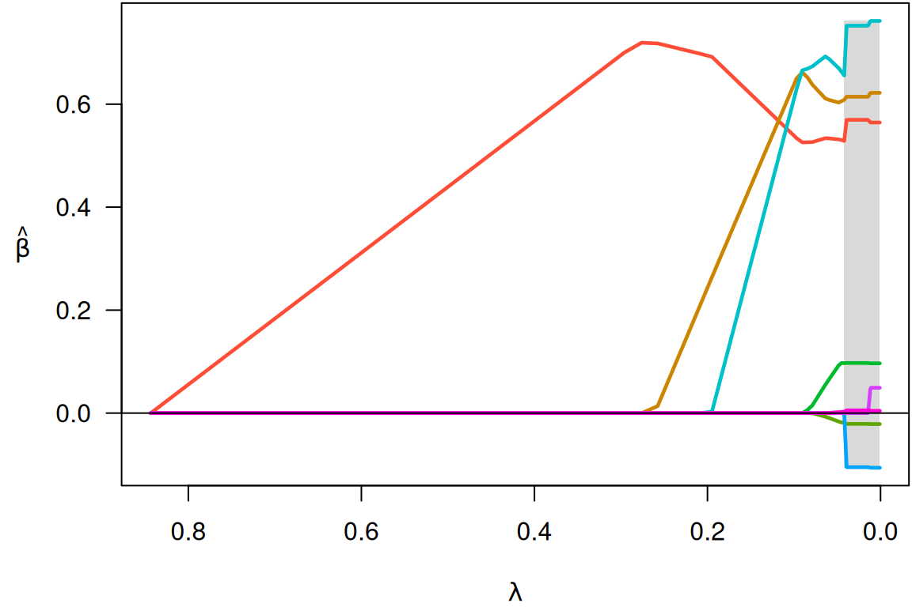
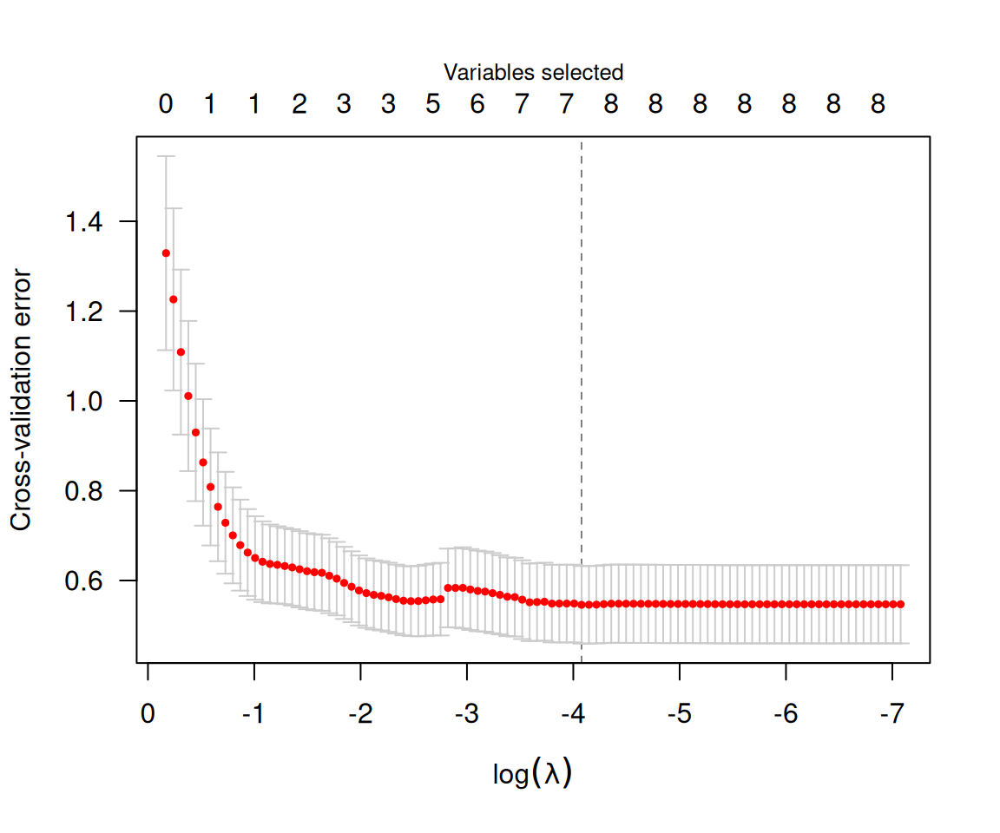

# Getting started with ncvreg

**[ncvreg](https://pbreheny.github.io/ncvreg/)** is an R package for
fitting regularization paths for linear regression, GLM, and Cox
regression models using lasso or nonconvex penalties, in particular the
minimax concave penalty (MCP) and smoothly clipped absolute deviation
(SCAD) penalty, with options for additional L₂ penalties (the “elastic
net” idea). Utilities for carrying out cross-validation as well as
post-fitting visualization, summarization, inference, and prediction are
also provided.

`ncvreg` comes with a few example data sets; we’ll look at `Prostate`,
which has 8 features and one continuous response, the PSA levels (on the
log scale) from men about to undergo radical prostatectomy:

``` r
data(Prostate)
X <- Prostate$X
y <- Prostate$y
```

To fit a penalized regression model to this data:

``` r
fit <- ncvreg(X, y)
```

The default penalty here is the minimax concave penalty (MCP), but SCAD
and lasso penalties are also available. This produces a path of
coefficients, which we can plot with

``` r
plot(fit)
```



Notice that variables enter the model one at a time, and that at any
given value of \lambda, several coefficients are zero. To see what the
coefficients are, we could use the `coef` function:

``` r
coef(fit, lambda=0.05)
# (Intercept)      lcavol     lweight         age        lbph         svi 
#  0.35121089  0.53178994  0.60389694 -0.01530917  0.08874563  0.67256096 
#         lcp     gleason       pgg45 
#  0.00000000  0.00000000  0.00168038
```

The `summary` method can be used for post-selection inference:

``` r
summary(fit, lambda=0.05)
# MCP-penalized linear regression with n=97, p=8
# At lambda=0.0500:
# -------------------------------------------------
#   Nonzero coefficients         :   6
#   Expected nonzero coefficients:   2.54
#   Average mfdr (6 features)    :   0.424
# 
#         Estimate      z     mfdr Selected
# lcavol   0.53179  8.880  < 1e-04        *
# svi      0.67256  3.945 0.010189        *
# lweight  0.60390  3.666 0.027894        *
# lbph     0.08875  1.928 0.773014        *
# age     -0.01531 -1.788 0.815269        *
# pgg45    0.00168  1.160 0.917570        *
```

In this case, it would appear that `lcavol`, `svi`, and `lweight` are
clearly associated with the response, even after adjusting for the other
variables in the model, while `lbph`, `age`, and `pgg45` may be false
positives included simply by chance.

Typically, one would carry out cross-validation for the purposes of
assessing the predictive accuracy of the model at various values of
\lambda:

``` r
cvfit <- cv.ncvreg(X, y)
summary(cvfit)
# MCP-penalized linear regression with n=97, p=8
# At minimum cross-validation error (lambda=0.0169):
# -------------------------------------------------
#   Nonzero coefficients: 7
#   Cross-validation error (deviance): 0.55
#   R-squared: 0.59
#   Signal-to-noise ratio: 1.42
#   Scale estimate (sigma): 0.739
plot(cvfit)
```



The value of \lambda that minimizes the cross-validation error is given
by `cvfit$lambda.min`, which in this case is 0.017. Applying `coef` to
the output of `cv.ncvreg` returns the coefficients at that value of
\lambda:

``` r
coef(cvfit)
#  (Intercept)       lcavol      lweight          age         lbph          svi 
#  0.494154801  0.569546027  0.614419811 -0.020913467  0.097352536  0.752397339 
#          lcp      gleason        pgg45 
# -0.104959403  0.000000000  0.005324465
```

Predicted values can be obtained via `predict`, which has a number of
options:

``` r
predict(cvfit, X=head(X))     # Prediction of response for new observations
#         1         2         3         4         5         6 
# 0.8304040 0.7650906 0.4262072 0.6230117 1.7449492 0.8449595
predict(cvfit, type="nvars")  # Number of nonzero coefficients
# 0.01695 
#       7
predict(cvfit, type="vars")   # Identity of the nonzero coefficients
#  lcavol lweight     age    lbph     svi     lcp   pgg45 
#       1       2       3       4       5       6       8
```

Note that the original fit (to the full data set) is returned as
`cvfit$fit`; it is not necessary to call both `ncvreg` and `cv.ncvreg`
to analyze a data set. For example, `plot(cvfit$fit)` will produce the
same coefficient path plot as `plot(fit)` above.
