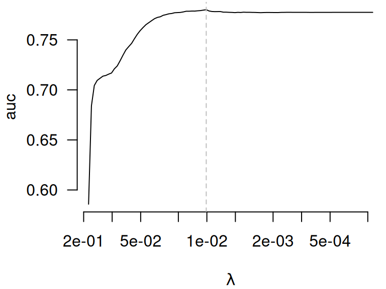

# Other CV criteria

By default,
[`cv.ncvreg()`](https://pbreheny.github.io/ncvreg/reference/cv.ncvreg.md)
returns the cross-validated deviance:

``` r
data(Heart)
X <- Heart$X
y <- Heart$y
cvfit <- cv.ncvreg(X, y, family='binomial')
head(cvfit$cve)
# [1] 1.286990 1.266179 1.243593 1.224601 1.208662 1.195316
```

In addition,
[`summary.cv.ncvreg()`](https://pbreheny.github.io/ncvreg/reference/summary.cv.ncvreg.md)
returns an estimated R^2, signal-to-noise ratio (SNR), and for logistic
regression, a misclassification error (PE, for prediction error):

``` r
head(summary(cvfit)$r.squared)
# [1] 0.003282658 0.023810623 0.045612276 0.063567043 0.078374606 0.090592299
head(summary(cvfit)$snr)
# [1] 0.00329347 0.02439140 0.04779219 0.06788211 0.08503955 0.09961682
head(summary(cvfit)$pe)
# [1] 0.3463203 0.3463203 0.3463203 0.3463203 0.3463203 0.3463203
```

It is very important to note here that these measures are based on
out-of-sample CV predictions, and therefore not artificially inflated by
overfitting, as would happen if we used the predictions from
[`ncvreg()`](https://pbreheny.github.io/ncvreg/reference/ncvreg.md)
directly.

In addition,
[`cv.ncvreg()`](https://pbreheny.github.io/ncvreg/reference/cv.ncvreg.md)
offers the option to return the cross-validated linear predictors
(`returnY=TRUE`), which allows the user to calculate any prediction
criteria they wish. For example, here is how one can calculate the
cross-validated AUC using the `auc()` function from the
[pROC](https://cran.r-project.org/package=pROC) package:

``` r
cvfit <- cv.ncvreg(X, y, family='binomial', returnY=TRUE)
auc <- apply(cvfit$Y, 2, pROC::auc, response=y, quiet=TRUE)
head(auc)
# [1] 0.5858133 0.6841163 0.7043978 0.7094681 0.7116204 0.7137314
plot(cvfit$lambda, auc, log='x', las=1, bty='n', xlab=expression(lambda), 
     xlim=rev(range(cvfit$lambda)), type='l')
abline(v=cvfit$lambda[which.max(auc)], lty=2, col='gray')
```


