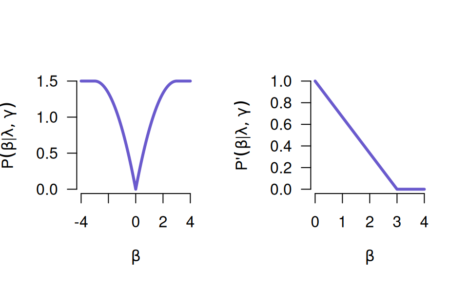
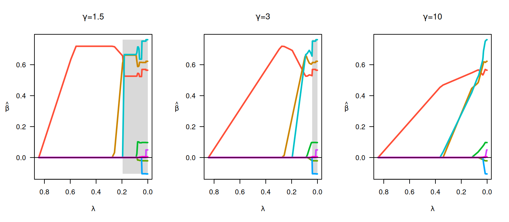
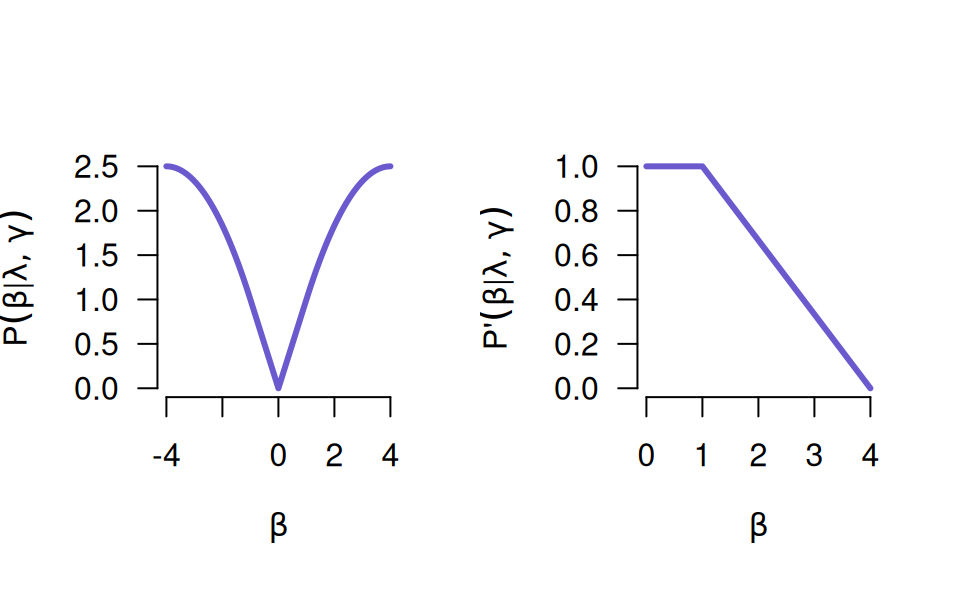
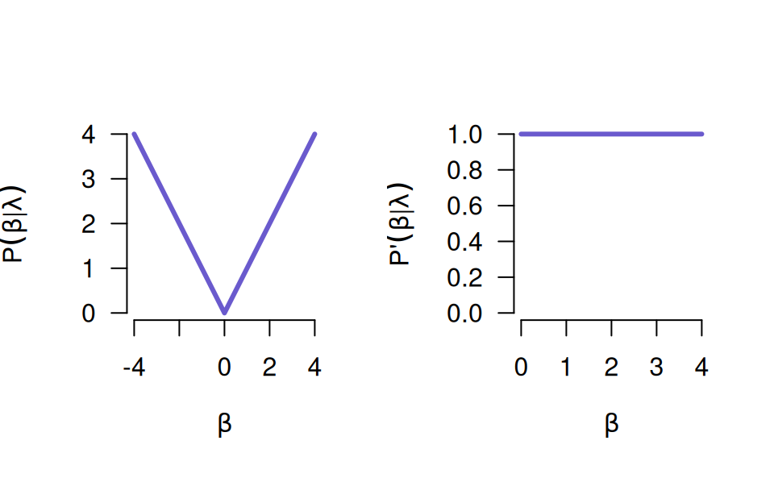
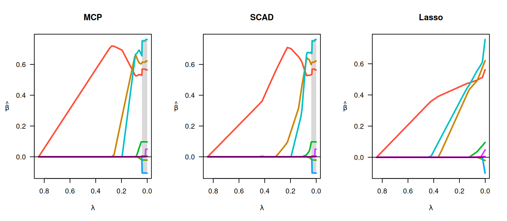
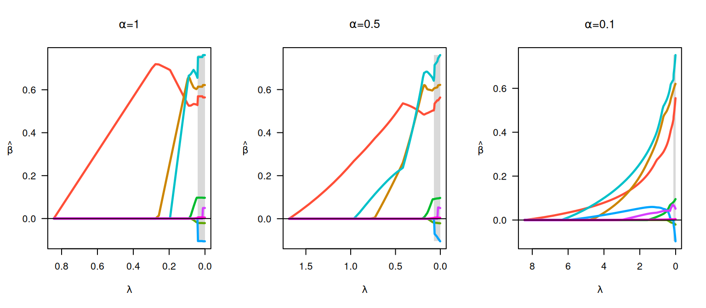

# Penalties

**ncvreg** fits models that fall into the penalized likelihood
framework. Rather than estimating \boldsymbol{\beta} by maximizing the
likelihood, in this framework we estimate \boldsymbol{\beta} by
minimizing the objective function

Q(\boldsymbol{\beta}\|\mathbf{X}, \mathbf{y}) =
L(\boldsymbol{\beta}\|\mathbf{X},\mathbf{y})+
P\_\lambda(\boldsymbol{\beta}),

where L(\boldsymbol{\beta}\|\mathbf{X},\mathbf{y}) is the loss
(deviance) and P\_\lambda(\boldsymbol{\beta}) is the penalty. This
article describes the different penalties available in **ncvreg**; see
[models](https://pbreheny.github.io/ncvreg/articles/models.md) for more
information on the different loss functions available. Throughout,
linear regression and the `Prostate` data set is used

``` r
data(Prostate)
x <- Prostate$X
y <- Prostate$y
```

## MCP

This is the default penalty in **ncvreg**.

P(\beta; \lambda, \gamma) = \begin{cases}
\lambda\|\beta\|-\frac{\beta^2}{2\gamma}, & \text{if } \|\beta\| \leq
\gamma\lambda\\ \frac{1}{2} \gamma\lambda^2, & \text{if } \|\beta\| \>
\gamma\lambda \end{cases}

for \gamma\> 1, or more compactly,

P(\beta;\lambda, \gamma) = \lambda\int_0^{\|\beta\|}
(1-t/(\gamma\lambda))\_+ dt.

A plot of the MCP (penalty on left, derivative on right):



The MCP starts out by applying the same rate of penalization as the
lasso, then smoothly relaxes the rate down to zero as the absolute value
of the coefficient increases.

The following figure illustrates the effect of changing \gamma:

``` r
par(mfrow = c(1,3))
fit <- ncvreg(x, y, gamma = 1.5)
plot(fit, main = expression(paste(gamma, "=", 1.5)))
fit <- ncvreg(x, y)
plot(fit, main = expression(paste(gamma, "=", 3)))
fit <- ncvreg(x, y, gamma = 10)
plot(fit, main = expression(paste(gamma, "=", 10)))
```



At smaller \gamma values, the estimates transition rapidly from 0 to
their unpenalized solutions; this transition happens more slowly and
gradually at larger \gamma values. Note that one consquence of these
rapid transitions at low \gamma values is that the solutions are less
stable (the gray region depicting the region of the solution path that
is not locally convex is larger).

## SCAD

The SCAD penalty is similar, except it does not immediately relax the
penalty.

P(\beta; \lambda, \gamma) = \begin{cases} \lambda\|\beta\| & \text{if }
\|\beta\| \leq \lambda, \\
\frac{2\gamma\lambda\|\beta\|-\beta^2-\lambda^2}{2(\gamma-1)} & \text{if
} \lambda\< \|\beta\| \< \gamma\lambda, \\ \frac{\lambda^2(\gamma+1)}{2}
& \text{if } \|\beta\| \geq \gamma\lambda, \end{cases}

or more compactly,

P(\beta; \lambda, \gamma) = \lambda\int_0^{\|\beta\|}
\min\\1,(\gamma-t/\lambda)\_+/(\gamma-1)\\dt.



## Lasso

P(\beta; \lambda) = \lambda\left\lvert\beta\right\rvert



``` r
par(mfrow = c(1,3))
fit <- ncvreg(x, y)
plot(fit, main = "MCP")
fit <- ncvreg(x, y, penalty = "SCAD")
plot(fit, main = "SCAD")
fit <- ncvreg(x, y, penalty = "lasso")
plot(fit, main = "Lasso")
```



## Elastic Net and MNet

All of the above penalties can be combined with a ridge penalty. For
example, we can add the lasso and ridge penalties (this is known as the
*elastic net*):

P(\beta; \lambda, \alpha) = \alpha\lambda\left\lvert beta\right\rvert +
(1 - \alpha) \lambda\beta^2

Here, alpha controls the tradeoff between the two penalties, with \alpha
= 1 being identical to the lasso penalty and \alpha = 0 being identical
to ridge. “MNet” (MCP + ridge) and “SCADNet” (SCAD + ridge) are formed
similarly.

``` r
par(mfrow = c(1, 3))
fit <- ncvreg(x, y)
plot(fit, main = expression(paste(alpha, "=", 1)))
fit <- ncvreg(x, y, alpha = 0.5)
plot(fit, main = expression(paste(alpha, "=", 0.5)))
fit <- ncvreg(x, y, alpha = 0.1)
plot(fit, main = expression(paste(alpha, "=", 0.1)))
```


