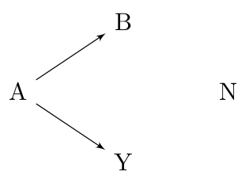

```{r setup, include=FALSE}
library(ncvreg)
knitr::opts_knit$set(aliases = c(h = 'fig.height', w = 'fig.width'))
knitr::opts_chunk$set(comment = "#", collapse = TRUE, cache = FALSE, tidy = FALSE)
knitr::knit_hooks$set(small.mar = function(before, options, envir) {
  if (before) par(mar = c(4, 4, .1, .1))
})
```

```{r, child='_commands.tex', results='asis'}
```

Consider the following causal diagram:



Variable $A$ could never be considered a false discovery: it has a direct causal relationship with the outcome $Y$. Likewise, if variable $N$ were selected, this would obviously count as a false discovery -- $N$ has no relationship, direct or indirect, to the outcome.

Variable $B$, however, occupies a gray area as far as false discoveries are concerned.  From a marginal perspective, $B$ is not a false discovery, since it is not independent of $Y$.  However, from a fully conditional perspective, $B$ is a false discovery because $B$ and $Y$ are conditionally independent given $A$.  Finally, from a modeling perspective, we could also adopt the point of view that $B$ is a false discovery only if $A$ is already in the model.

To be more specific, here are the definitions of a false discovery under these three perspectives:

* **Marginal** --- A selected feature $j$ is a false discovery if it is marginally independent of the outcome: $X_j \ind Y$.
* **Fully conditional** --- A selected feature $j$ is a false discovery if it is independent of the outcome given all other features: $X_j \ind Y | \{X_k\}_{k \neq j}$.
* **Partially conditional** --- A selected feature $j$ is a false discovery if it is independent of the outcome given the other features in the model: $X_j \ind Y | \{X_k:k \in \cM_{j-}\}$, where $\cM_{j-}$ denotes the set of features with nonzero coefficients in the model, excluding feature $j$.

Estimating the number of false selections from fully conditional and partially conditional perspectives is both complicated and tends to have low power (because it is typically difficulty to distinguish between variables like $B$ and variables like $A$ in high dimensions).

Estimating the number of false discoveries from the marginal perspective, however, is much easier. We illustrate the concept behind marginal false discovery rates (mFDR) below; see the [original article](https://doi.org/10.1093/biostatistics/kxy004) for more details on the mathematics behind it.

First, let's fit a lasso model:

```{r}
data(Prostate)
fit <- ncvreg(Prostate$X, Prostate$y)
```

The marginal false discovery rate at a given value of $\lam$ is given by

$$ \text{mFDR}(\lam) = \frac{\Ex(\text{mFD}(\lam))}{S(\lam)}, $$

where $S(\lam)$ is the number of variables selected and $\text{mFD}(\lam)$ is the number of (marginal) false discoveries -- i.e., the number of pure noise variables like $N$ that have been selected. The `mfdr()` function estimates the expected value of $\text{mFD}(\lam)$ based on the hypothetical null scenario in which all predictors are noise and calculates the mFDR:

```{r}
marginal_fdr <- mfdr(fit)
```

At the start of the lasso path, only one variable has been selected, and $\lam$ is so large that it would be extremely unlikely for any selections to have occurred by chance alone; as a result, the mFDR is very low:

```{r}
head(marginal_fdr)
```

Towards the end of the lasso path, all variables has been selected, and $\lam$ is so small that even if all the predictors were noise, we would probably select them anyway; as a result, the mFDR is very high:

```{r}
tail(marginal_fdr)
```

Marginal FDRs will typically be most valuable somewhere in the middle:

```{r}
marginal_fdr[24:27,]
```

For this data set, we can select three features at a low false discovery rate, but the FDR increases above 10% as we consider models with lower penalties. A plotting method is provided for mFDR objects, with two available plot types:

```{r, fig.width=6, fig.height=3, out.width="100%"}
par(mfrow = c(1,2))
plot(marginal_fdr, type = "mFDR")
plot(marginal_fdr, type = "EF")
```

The mFDR is a global measure that describes the entire model; for feature-specific false discovery rates, see the article on [local mfdr](inference-local).
